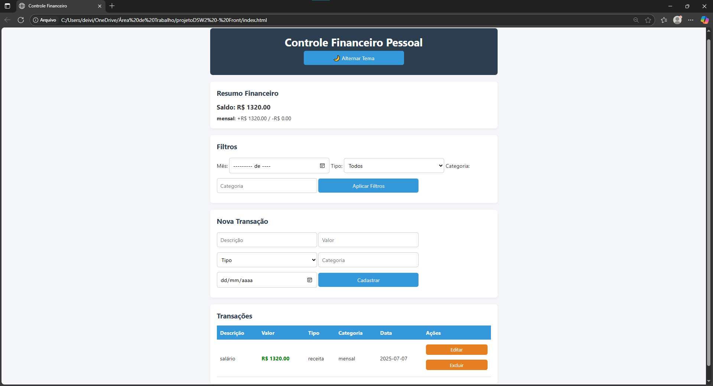

# 💸 Controle Financeiro Pessoal - Front-End

Este é o front-end do sistema de controle financeiro pessoal. A aplicação é construída com **HTML**, **CSS** e **JavaScript** puro, e consome a [API REST do projeto](https://github.com/deividbrito/projetoDSW2---Back.git).

## 📷 Visão Geral




## 🎥 Vídeo Demonstrativo

Abaixo está o link para o vídeo demonstrativo do projeto:

[Inserir Link do Vídeo](INSERIR)

## 🎯 Funcionalidades

- Visualização de transações
- Filtros por mês, tipo e categoria
- Cadastro de novas transações
- Edição e exclusão de transações
- Resumo financeiro com saldo e totais por categoria

## 🧠 Como Funciona

A página consome os endpoints REST da API hospedada separadamente. É necessário que o **back-end** esteja em execução para o funcionamento completo.

## 🔗 Conectando com a API

A URL da API está definida no `app.js`:

```js
const BASE_URL = 'http://localhost:8080/controle-financeiro-api';
```

Altere conforme necessário caso o back-end esteja em outro host ou porta.

## 📁 Estrutura

```
/
├── index.html
├── style.css
└── app.js
```

## 🛠 Tecnologias

- **HTML5**
- **CSS3**
- **JavaScript (ES6+)**
- **Fetch API**

## 🚀 Como executar

1. Clone o repositório
2. Abra o arquivo `index.html` no navegador
3. Certifique-se que a API esteja rodando localmente (porta 8080)
